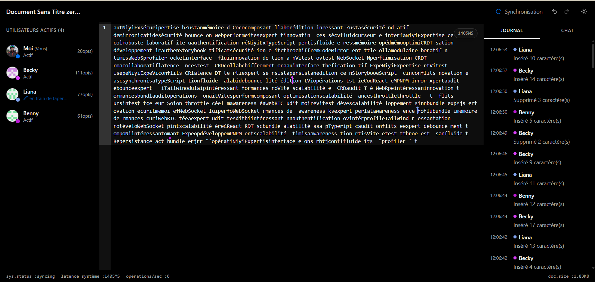
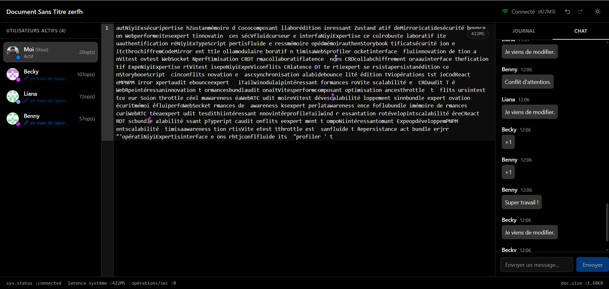
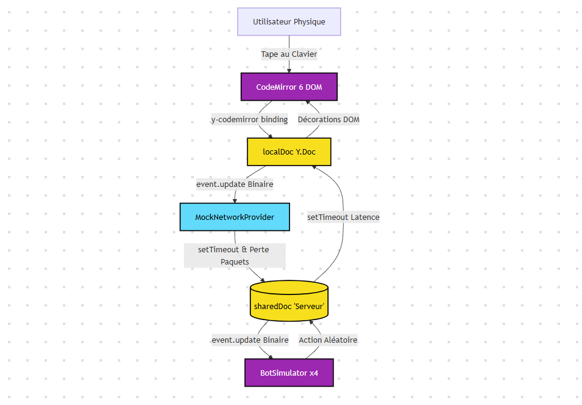

# Collaborative Editor

> Éditeur de texte collaboratif temps réel simulant des interactions multi-utilisateurs.
> Réalisé dans le cadre du test technique NiyiExpertise — Frontend 2026.


---

## Aperçu






---

## Stack technique

| Catégorie | Technologie |
|---        |---             |
| Framework | React 19 + Vite |
| Collaboration | Yjs + y-codemirror.next |
| Éditeur | CodeMirror 6 |
| State management | Zustand |
| Styling | Tailwind CSS |
| Tests unitaires | Vitest + Testing Library |
| Tests E2E | Playwright |
| Documentation | Storybook 8 |

---

## Fonctionnalités

- ✅ Édition collaborative simulée avec 3 bots (CRDT via Yjs)
- ✅ Latence réseau aléatoire (100ms – 1500ms) et perte de paquets (1%)
- ✅ Curseurs multiples en temps réel (via CodeMirror Decorations)
- ✅ Undo / Redo natif via Yjs UndoManager
- ✅ Journal d'activité chronologique + module de chat
- ✅ Dark mode complet
- ✅ Responsive design (desktop, tablette)
- ✅ Zéro re-render global lors de la saisie (vérifié avec React DevTools)

---

## Prérequis

- Node.js >= 20.x
- pnpm >= 10.x

---

## Installation
```bash
# Cloner le dépôt
git clone https://github.com/enockmigjr/collaborative-editor.git
cd collaborative-editor

# Installer les dépendances
pnpm install

# Lancer en développement
pnpm dev
```

---

## Scripts disponibles
```bash
pnpm dev              # Serveur de développement (port 5173)
pnpm build            # Build de production
pnpm preview          # Prévisualisation du build

pnpm test             # Tests unitaires (Vitest)
pnpm test:ui          # Tests unitaires avec UI Vitest
pnpm test:coverage    # Couverture de code

pnpm test:e2e         # Tests E2E Playwright (headless)
pnpm test:e2e:ui      # Tests E2E avec interface Playwright

pnpm storybook        # Storybook (port 6006)
pnpm build-storybook  # Build statique Storybook

pnpm lint             # ESLint
pnpm format           # Prettier
pnpm prepare          # Prepare les hooks git
```

---

## Architecture
```
src/
├── components/     # Composants React (Header, Editor, Panels, Footer)
├── simulation/     # Logique de simulation (bots, réseau)
├── store/          # Zustand stores (connexion, logs, UI)
├── hooks/          # Hooks personnalisés (collaboration, réseau)
├── lib/            # Yjs provider, setup CodeMirror
└── types/          # Types TypeScript stricts
```

> Voir [ARCHITECTURE.md](docs/ARCHITECTURE.md) pour le détail des décisions techniques.

---

## Contribuer

Voir [CONTRIBUTING.md](CONTRIBUTING.md).

---

## Licence

[MIT](LICENSE) © 2026 Enock Mignanwande Junior 
```

---